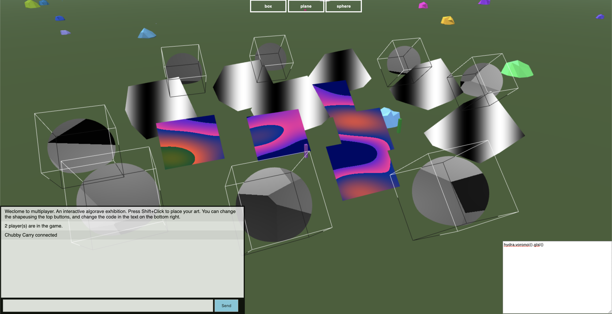

# multiplayer algorave
a multiplayer algorave exhibition using node.js, socket.io, babylon.js and hydra

## General

- [ ] Improve UI
- [ ] Add CodeMirror
- [x] Send exhibits to server
- [ ] Typescript server

## Hydra

https://github.com/ojack/hydra

- [x] hydra-synth
- [x] Fragment shader code

## Babylon

- [x] Scene Serializer
- [x] Null Engine
- [ ] Gizmo Manager

#### Examples
- https://github.com/j-o-d-o/multiplayer-babylon-js-game
- https://github.com/creationspirit/multiplayer-browser-game-boilerplate/tree/master/client/src
- https://punkoffice.com/3d_multiplayer_games
- https://www.babylonjs-playground.com/#1WROZH#67
- https://www.babylonjs-playground.com/#1OH09K#123
- https://cineshader.com/editor
- https://doc.babylonjs.com/features/nullengine 
- https://doc.babylonjs.com/api/classes/babylon.sceneserializer
